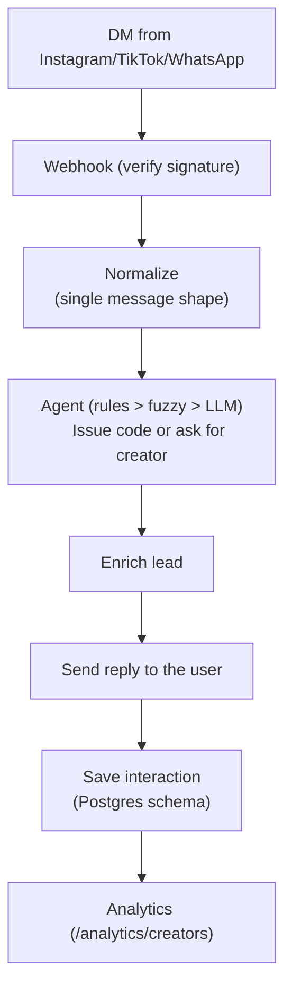
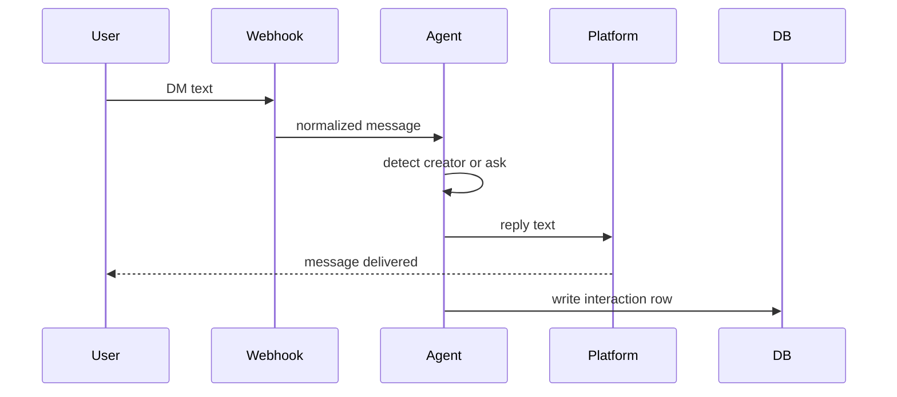

# AI Discount Agent

A production-oriented DM agent for Instagram, TikTok, and WhatsApp that issues the right discount code quickly and safely.
Messages are normalized and passed through a rule‑first pipeline: exact match, then fuzzy, then (if needed) a tightly bounded LLM. So it’s fast, predictable, and cost‑controlled.
Every interaction is enriched per user_id, logged to a Postgres‑ready schema, and surfaced via a simple analytics endpoint, with real webhooks, signature stubs, and an interactive CLI for hands‑on testing.

## Architecture Overview

### System Diagram






## Approach Overview

**A rule‑first agent that stays fast, predictable, and cheap.** Messages are normalized into one shape, passed through exact and fuzzy detection, and only then (if needed) into a tightly bounded LLM. Every interaction is logged for analytics and lead scoring.

* **Hybrid detection:** exact → fuzzy → LLM (2 attempts, hard time budgets; allow‑listed JSON).
* **Smart intent:** keyword + fuzzy‑aware intent to avoid LLM calls on noise.
* **Data logging:** we persist a row per interaction that maps 1:1 to a Postgres‑ready schema (timestamp, platform, raw text, identified_creator, discount_code_sent, status, enrichment fields).
* **Idempotency:** one code per (platform, user); resend returns the same code without re‑issuance.
* **Lead enrichment:** after a creator is identified, we enrich the user_id deterministically (follower_count, is_potential_influencer) and include it in the logged row.
* **Analytics:** /analytics/creators summarizes requests and codes_sent per creator, with per‑platform breakdown.
* **Ops & DX:** hot config reload, interactive CLI chat, explain‑mode traces, and a demo script that showcases exact, fuzzy, ask, LLM, and normalization cases.
* **Tests:** 25+ concise tests cover detection (exact/fuzzy/intent), normalization (punctuation/Unicode/emoji), LLM fallback (mocked), conversation flows, analytics, admin, and platform normalizers.


## Tooling Justification

* **LangGraph:** Explicit, testable state machine (normalize → intent → exact → fuzzy → LLM → decide). Predictable flow, easy to trace, simple to extend; supports async nodes.
* **Pydantic v2:** Typed models for IncomingMessage, AgentDecision, and InteractionRow with ISO8601 timestamp validation. Safer contracts, cleaner API responses via model_dump().
* **FastAPI + Uvicorn:** Async endpoints for /simulate, /webhook/{platform}, /analytics/creators, /admin/*. Small, fast, auto‑docs, great DX for a prototype and beyond.
* **RapidFuzz:** Partial string similarity for alias matching with thresholds.Solid performance and control before resorting to an LLM.
* **Gemini 2.5 Flash Lite:** Bounded cost/latency with safe, parseable responses.


## Quick Demo (2 minutes)

```bash
git clone https://github.com/AlexAtmtit/ai-discount-agent
cd ai-discount-agent
./setup.sh              # Setup virtual environment and dependencies
./demo.sh               # Run the standalone agent demo

# Optional advanced demo (explain + mock LLM + clean state)
python3 scripts/demo_agent.py --explain --reset --mock-llm success
```

## Full Setup Instructions

1. **Clone and install**:
   ```bash
   git clone https://github.com/AlexAtmtit/ai-discount-agent
   cd ai-discount-agent
   ./setup.sh
   ```

2. **Optional LLM setup**:
   ```bash
   export GOOGLE_API_KEY=your_api_key
   ```

3. **Run demo**:
   ```bash
   ./demo.sh             # quick demo
   # or advanced options
   python3 scripts/demo_agent.py --explain --reset --mock-llm success
   ```

4. **Start server**:
   ```bash
   ./run.sh  # FastAPI server on localhost:8000
   ```

### Interactive CLI Chat (optional)

Start the server in one terminal:
```bash
./run.sh
```

Open another terminal for a chat session:
```bash
./chat.sh --server http://localhost:8000 --user cli_user --platform instagram --explain
```

Now type messages (no cURL needed). Commands:
- `/help` — list commands
- `/reset` — clear in-memory store on server
- `/reload` — reload YAML configs
- `/quit` — exit

If `GOOGLE_API_KEY` is set before starting the server, ambiguous messages will use LLM fallback where rules can’t decide.


### Sample Output
```
INPUT:
  mkbhd sent me
METHOD:
  📏 EXACT MATCH
REPLY:
  Here's your discount code from mkbhd: MARQUES20 
ROW:
  user_id: demo_user_1
  platform: instagram
  timestamp: 2025-09-15T16:57:48.505Z
  raw_incoming_message: mkbhd sent me
  identified_creator: mkbhd
  discount_code_sent: MARQUES20
  conversation_status: completed
  follower_count: 108028
  is_potential_influencer: true

INPUT:
  promo code
METHOD:
  🤖 ASK (no confident creator)
REPLY:
  Thanks for your message! Which creator sent you? 😊
ROW:
  user_id: demo_user_2
  platform: instagram
  timestamp: 2025-09-15T16:58:12.123Z
  raw_incoming_message: promo code
  identified_creator: null
  discount_code_sent: null
  conversation_status: pending_creator_info
  follower_count: null
  is_potential_influencer: null
```

Fuzzy match example
```
INPUT:
  marqes brwnli promo
METHOD:
  🌀 FUZZY MATCH
REPLY:
  Here's your discount code from mkbhd: MARQUES20
ROW:
  user_id: demo_user_3
  platform: instagram
  timestamp: 2025-09-15T16:59:22.456Z
  raw_incoming_message: marqes brwnli promo
  identified_creator: mkbhd
  discount_code_sent: MARQUES20
  conversation_status: completed
  follower_count: 98231
  is_potential_influencer: true
```

## Database Schema

The app uses an in‑memory store for the demo, but the production table (Postgres) is:

```sql
CREATE TABLE IF NOT EXISTS interactions (
  id BIGSERIAL PRIMARY KEY,
  user_id TEXT NOT NULL,
  platform TEXT NOT NULL CHECK (platform IN ('instagram','tiktok','whatsapp')),
  timestamp TIMESTAMPTZ NOT NULL,                -- initial request time (UTC)
  raw_incoming_message TEXT NOT NULL,
  identified_creator TEXT NULL,                   -- NULL when unknown/ask
  discount_code_sent TEXT NULL,                   -- NULL when unknown/ask
  conversation_status TEXT NOT NULL CHECK (       -- core statuses per brief + 'out_of_scope'
    conversation_status IN ('pending_creator_info','completed','error','out_of_scope')
  ),
  -- Lead Enrichment:
  follower_count INTEGER NULL,
  is_potential_influencer BOOLEAN NULL
);
```


## Addtional Features


### Enrichment & Lead Scoring
We simulate lead enrichment for the user_id after the creator is identified. The agent deterministically computes `follower_count` and `is_potential_influencer` from `user_id` (hash‑based), and includes them in the `database_row`. The production schema includes these columns.

### Analytics Endpoint
```
GET /analytics/creators
```
Returns aggregated summary of codes distributed by creator and platform.


## Normalization & Enrichment

- Normalization (noise-tolerant):
  - Lowercases; collapses whitespace; replaces common ASCII punctuation with spaces and normalizes smart quotes/dashes; preserves “@” mentions; emoji‑tolerant.
  - Examples:
    - "casey-neistat discount" → "casey neistat discount" (matches alias)
    - "Lily’s video discount" → "lily s video discount" (Unicode apostrophe normalized; matches alias "lily")
    - "I came from @mkbhd, need code" → in‑scope via mention; proceeds to detection
    - "mkbhd 😃🔥 sent me" → emojis preserved; exact "mkbhd" still matches

- Lead Enrichment:
  - After the creator is identified, we simulate enrichment for the user_id (hash‑based):
    - follower_count (int)
    - is_potential_influencer (bool)
  - These fields are included in the `database_row` and defined in the Postgres schema.

## Test Suite Summary (short)

- `tests/test_agent_core.py`: core detection and response flows; out_of_scope, ask_creator, idempotency; platform handling; row shape and timestamp format.
- `tests/test_conversation.py`: multi-turn conversations: ask → creator → issue; out_of_scope → creator; completed then resend blocked; fuzzy follow-up issuance.
- `tests/test_fuzzy_and_llm.py`: fuzzy acceptance for misspellings; mocked LLM fallback tests (retry success, terminal none, budget exhausted) using async processing.
- `tests/test_api_endpoints.py`: `/simulate` round-trip and `/analytics/creators` summary; `/admin/reset` clears state; `/admin/reload` applies a new alias and affects next requests.
- `tests/test_platform_normalizer.py`: validates that Instagram, TikTok, and WhatsApp payloads normalize correctly into the internal shape.
- `tests/test_normalization.py`: normalization robustness (trailing punctuation, whitespace/case, hyphenation, Unicode punctuation, mention punctuation, emoji noise) — all still resolve to the correct creator/code.


## API Endpoints

### `/simulate` (POST)
End-to-end message processing for testing:
```json
{
  "platform": "instagram",
  "user_id": "user123",
  "message": "discount from mkbhd"
}
```
Response:
```json
{
  "reply": "Here's your discount code from mkbhd: MARQUES20",
  "database_row": { ... },
  "detection_method": "exact|fuzzy|llm|null",
  "detection_confidence": 0.0
}
```

### `/webhook/{platform}` (POST)
Prototype webhook endpoint that processes messages inline and returns `{reply, database_row, detection_method, detection_confidence}`; for production, the diagrams show a planned fast‑path/worker split.

### `/analytics/creators` (GET)
Summary statistics for campaign effectiveness (by creator, across all platforms). Response shape:
```json
{
  "total_creators": 3,
  "total_requests": 10,
  "total_completed": 6,
  "creators": {
    "mkbhd": {
      "requests": 5,
      "codes_sent": 4,
      "platform_breakdown": {
        "instagram": { "requests": 4, "codes_sent": 3 },
        "tiktok":    { "requests": 1, "codes_sent": 1 }
      }
    }
  }
}
```

### `/admin/reload` (POST)
Hot-reload campaign and template configs from YAML.

### `/admin/reset` (POST)
Demo-only endpoint to clear the in-memory store.

## Testing

Run the test suite:
```bash
./test.sh
```

The suite covers:
- **Detection logic**: exact/alias, fuzzy acceptance, fuzzy-aware intent (“from <handle>”)
- **Normalization**: punctuation/Unicode/emoji/whitespace/hyphenation — still detects the right creator
- **Conversational flows**: ask → creator, out_of_scope → creator, resend blocked
- **LLM fallback**: retry success (mocked), terminal none; bounded time budgets
- **Integration**: /simulate end-to-end, analytics summary aggregation
- **Idempotency**: one-code-per-user guarantee per (platform,user)
- **Admin**: /admin/reset clears store; /admin/reload applies new aliases

## Campaign Configuration

Creator codes and aliases in `config/campaign.yaml`:

```yaml
creators:
  casey_neistat:
    code: CASEY15OFF
    aliases:
      - casey
      - neistat
      - @casey
  mkbhd:
    code: MARQUES20
    aliases:
      - marques
      - mkbhd
      - @mkbhd
```

Reply templates in `config/templates.yaml`:

```yaml
replies:
  issue_code: "Here's your discount code from {creator_handle}: {discount_code}"
  ask_creator: "Which creator sent you? I have codes from Casey Neistat, Marques Brownlee, Lily Singh, Peter McKinnon."
  ambiguous: "Could you clarify which creator sent you? {creator_handle} or {other_creator}?"
```
